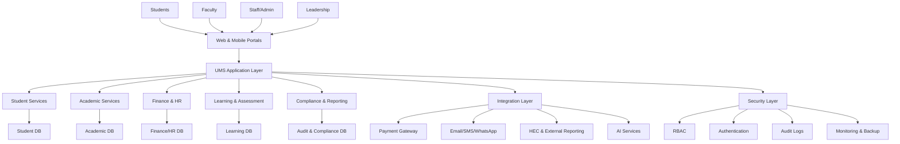

# System Architecture Overview

## 1. Architectural Goal
The University Management System should be designed as a connected ecosystem that supports academic operations, administrative management, student services, finance, and compliance while ensuring secure access and scalable operations.

## 2. High-Level Logical Architecture

## 3. Core Service Domains
### A. Student Lifecycle Management
- admissions
- registration
- enrollment
- attendance
- advising
- graduation
- alumni services

### B. Academic Management
- curriculum
- course design
- learning outcomes
- assessment planning
- grading and result publishing

### C. Operations and Campus Services
- library
- hostel
- transport
- cafeteria
- labs and classrooms

### D. Institutional Support
- HR and payroll
- finance and accounting
- budgeting
- scholarship and aid
- procurement and approvals

### E. Governance and Compliance
- audit trails
- policy enforcement
- HEC reporting
- accreditation files
- quality assurance

## 4. Shared Platform Services
- identity and access management
- master data management
- notification engine
- document repository
- workflow and approval engine
- analytics and dashboards
- AI governance controls

## 5. Integration Considerations
The platform should not operate as isolated silos. It should connect with:
- LMS systems
- ERP and financial systems
- student CRM and admissions systems
- payments and bank systems
- SMS/email/WhatsApp providers
- external compliance/reporting tools
- AI platforms (Maya, Zara, or equivalent)

## 6. Security Architecture
- role-based access control
- MFA and strong authentication
- encryption in transit and at rest
- audit logs for critical actions
- access review by role
- incident response and backup recovery

## 7. Data Architecture Principles
- single source of truth for core records
- master IDs for student, faculty, course, program, and department
- cross-module consistency
- policy-defined retention of historic records
- clear ownership of each data domain

## 8. Recommended Delivery Pattern
Use layered architecture with shared services and modular applications rather than one big, risky monolith. This allows the university to pilot and scale incrementally.

---

## 9. Practical Summary
The ideal platform is a secure, modular, role-based, API-enabled academic and administrative system that centralizes university data while preserving department autonomy and governance controls.
