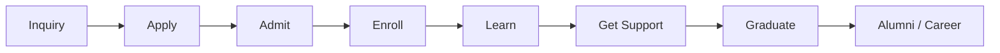
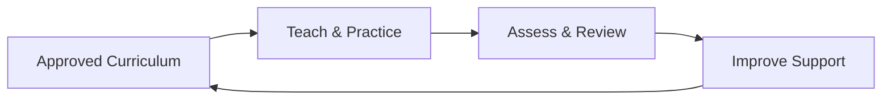
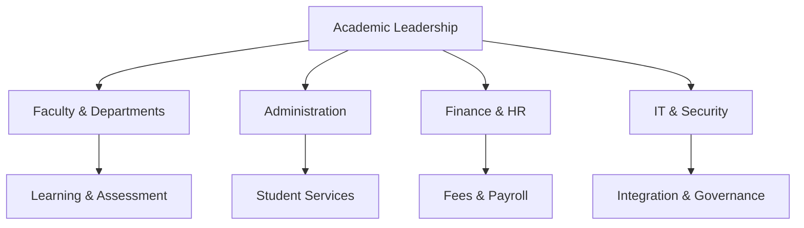
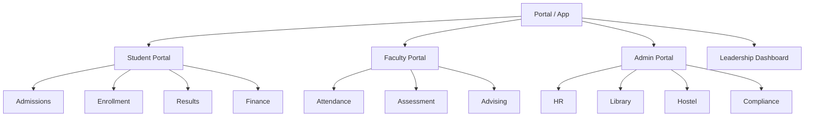
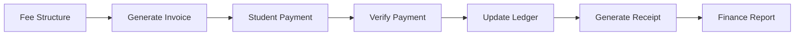
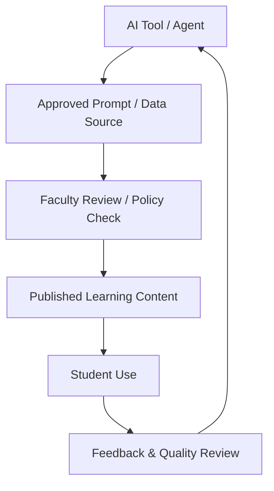
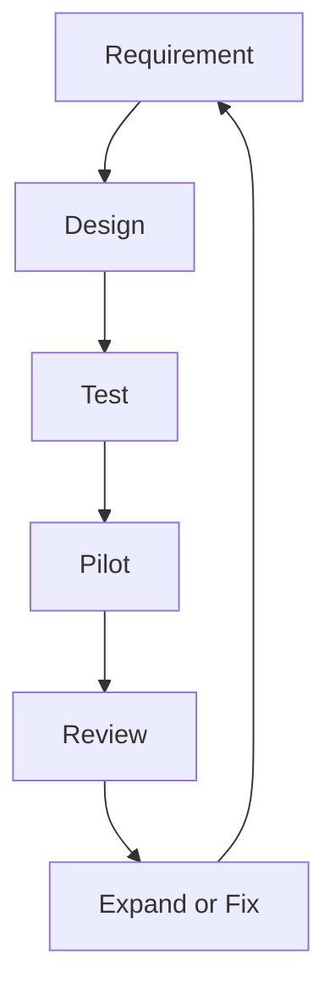
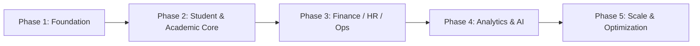

# Key Diagrams

## 1. Student Journey Flow

## 2. Academic Outcome Loop

## 3. University Operating Model

## 4. Service-Oriented Module View

## 5. Data Flow Example: Fee Processing

## 6. AI Governance Model

## 7. Risk-Control Model

## 8. Implementation Phases

---

These diagrams help leadership understand the system in a clear visual format for presentations and governance meetings.
